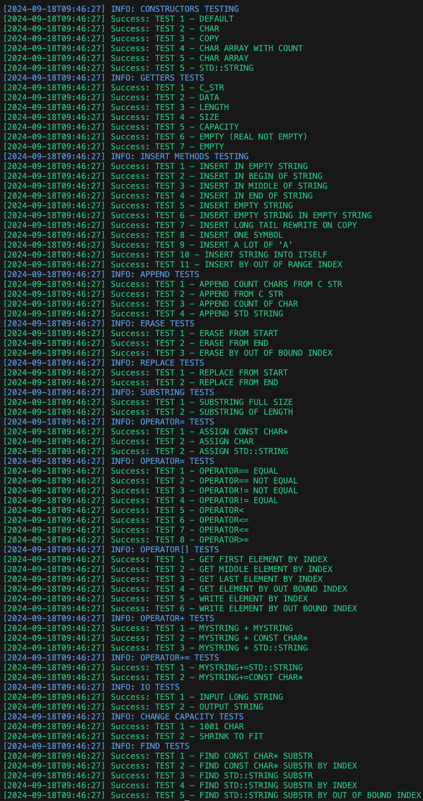

# Занятие №2

- Все методы, которые необходимо реализовать в рамках класса MyString (приведены в таблице в файле "Лабораторная_1_задание.docx");

## Запуск тестов

1. Получить содержимое данной ветки в локальный репозиторий лабораторной работы
2. Подключить заголовочный файл к main.cpp (которы содержит точку входа программы - функцию main)
- tests/test_<название группы методов>.h - только тесты для указанной группы методов
- tests/test_all.h - тесты для всех метов
3. В начало функции main добавить вызов:
- test_<название группы методов>() - тестирование указанной группы методов
- test() - тестирование всех метов
4. Скомпилировать и запустить программу

## Пример вывода при успешном завершении тестирования (test_all)
