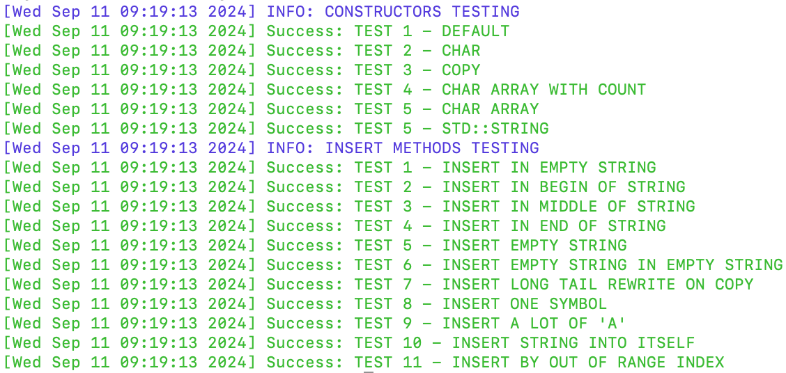

# Занятие №1
- Конструкторы
- Методы c_str, length, capacity (getters)
- Методы insert

## Запуск тесто

1. Склонировать данную ветку в локальный репозиторий лабораторной работы
2. Подключить заголовочный файл к .cpp файлу, содержащему точку входа программы (имя функция по умолчанию - main):
- tests/test_ctor.h - только тесты для конструкторов
- tests/test_all.h - тесты для конструкторов и методов insert
3. В начало функции main добавить вызов:
- test_constructors() - тестирование конструкторов
- test() - тестирование конструкторов и методов insert
4. Скомпилировать и запустить программу

## Пример вывода при успешном завершении тестирования (test_all)
